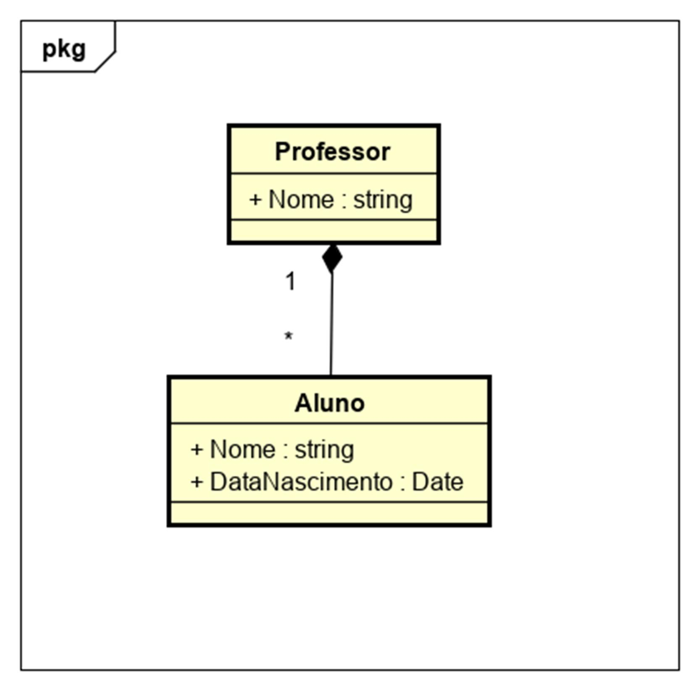

# Avaliação Prática 

O exercício a seguir têm o propósito de medir de forma básica as habilidades do candidato diante de situações cotidianas, no que diz respeito à rotina do profissional de desenvolvimento de sistemas.  Boa Sorte! 
 
Desenvolver um projeto web C# (Web Forms ou MVC) para cadastro de professores e alunos, persistindo os registros em um banco de dados. 

No projeto, além das telas de cadastros, deverão existir 2 listagens: 

1. Lista com os alunos maiores de 16 anos, informando o professor de cada um; 
2. Lista com os professores cuja média de idade de seus alunos é de 15 a 17 anos; 

Segue diagrama de classes à ser aplicado: 
 
 

Atualização 22/05/2019